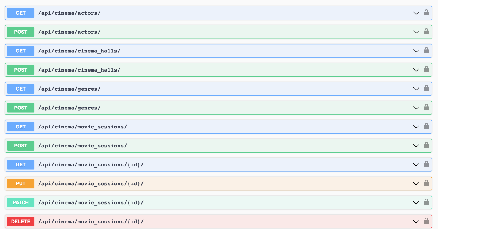

# Cinema Service API

Experience the magic of the movies like never before with powerful Django REST Framework API. 
Manage your cinema service from user registration to ticket sales and everything in between. 
Intuitive features for film, actor, genre, movie session management and cinema hall options.
Streamline your operations and deliver unforgettable cinematic experiences with ease!

### 💾 Installing using GIT
```shell
  git clone https://github.com/Anatolii-Poznyak/cinema-service-API.git
  cd cinema_api
  python -m venv venv
```

### 💻 Linux/macOS:
```shell
  source venv/bin/activate
  pip install -r requirements.txt
  export DB_HOST=<your db hostname>
  export DB_NAME=<your db name>
  export DB_USER=<your db user>
  export DB_PASSWORD=<your db password>
  export DB_SECRET_KEY=<your secret key>
```

### 🖥 Windows:
```shell
  venv\Scripts\activate
  pip install -r requirements.txt
  set DB_HOST=<your db hostname>
  set DB_NAME=<your db name>
  set DB_USER=<your db user>
  set DB_PASSWORD=<your db password>
  set DB_SECRET_KEY=<your secret key>
```

### 👆 After setting .env variables:
```shell
  python manage.py migrate
  python manage.py runserver
```
### 📀 Run with DOCKER
- DOCKER should be installed

```shell
  docker-compose build
  docker-compose up
```

- Also, you can create new admin user.
- Enter container ```python docker exec -it <container_name> bash```, and create in from there.


### 🗝 Getting access:
```shell
  create user via /api/user/register/
  get access token via /api/user/token/
```

### 🧾 Features
- JWT authenticated 🔒
- Admin panel /admin/
- Creating movies with genres, actors
- Creating cinema halls
- Adding movie sessions
- Managing orders and tickets
- Filtering movies and movie sessions

### 🕶 Documentation: swagger
```
/api/doc/swagger/
```


